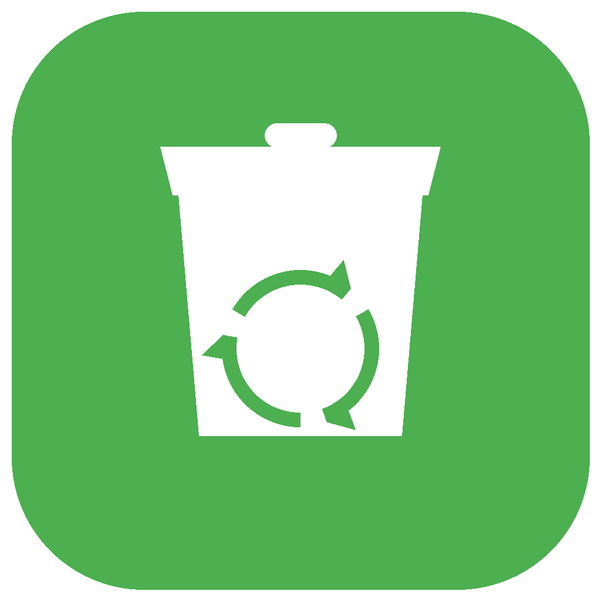
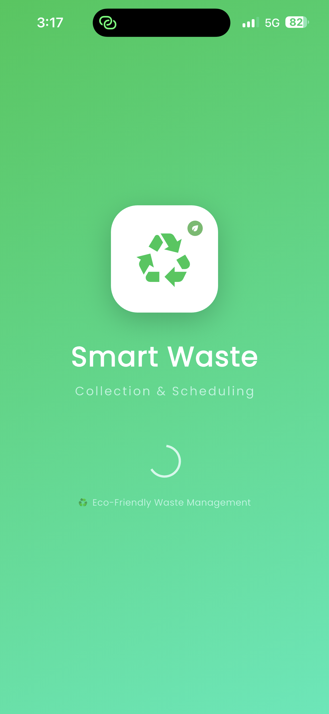

# 🌱 Smart Waste Collection App

<p align="center">
  
</p>

<p align="center">
  <strong>A comprehensive mobile application for smart waste management</strong>
</p>

<p align="center">
  <a href="#features">Features</a> •
  <a href="#screenshots">Screenshots</a> •
  <a href="#tech-stack">Tech Stack</a> •
  <a href="#installation">Installation</a> •
  <a href="#firebase-setup">Firebase Setup</a>
</p>

<p align="center">
  
  
  
  
  
</p>

---

## 📖 About The Project

**Smart Waste Collection App** is a full-featured mobile application designed to revolutionize waste management. It connects users who need waste pickup services with collectors, all managed through an admin dashboard. The app promotes eco-friendly practices through a reward system and provides real-time tracking of waste collection.

### 🎯 Problem It Solves

- **Inefficient Waste Collection**: Traditional waste collection lacks scheduling and tracking
- **No User Engagement**: Users have no incentive to properly dispose of waste
- **Poor Communication**: No direct communication between users and collectors
- **Lack of Transparency**: No visibility into pickup status or collector location

---

## ✨ Features

### 👤 For Users
- 📅 **Schedule Pickups** - Request waste collection at your convenience
- 📍 **Location Selection** - Choose pickup location with interactive map
- 📊 **Track Status** - Real-time pickup status tracking
- 🏆 **Eco Points** - Earn rewards for recycling
- 🎁 **Redeem Rewards** - Convert eco points to vouchers
- 🔔 **Notifications** - Get updates on pickup status
- 🤖 **EcoBot Assistant** - AI chatbot for instant support
- 🌙 **Dark Mode** - Eye-friendly dark theme

### 🚛 For Collectors
- 📋 **Pickup Management** - View and manage assigned pickups
- ✅ **Status Updates** - Update pickup status in real-time
- 🗺️ **Navigation** - Get directions to pickup locations
- 📈 **Performance Stats** - Track completed pickups
- 🔔 **Push Notifications** - Receive new pickup alerts

### 👨‍💼 For Admins
- 📊 **Dashboard** - Overview of all system activities
- 👥 **User Management** - Manage all users and collectors
- 🚚 **Pickup Oversight** - Monitor all pickup requests
- 📈 **Analytics** - View system statistics
- 🎁 **Reward Approvals** - Approve reward redemption requests
- ⚙️ **System Settings** - Configure app settings

---

## 📱 Screenshots

### 🎨 Authentication Screens

<div align="center">

| Splash Screen | Welcome Screen | Phone Login |
|:-------------:|:--------------:|:-----------:|
|  |  |  |
| **Light Theme Splash** | **EcoCollect Landing** | **OTP Verification** |
| Green gradient background with Smart Waste branding and recycling icon. Shows app tagline "Collection & Scheduling" and eco-friendly message. | Dark theme welcome screen featuring two login options: Phone (fast & secure OTP) and Email. Includes quick access buttons for scheduling, tracking, and rewards. | Phone number input with country code selector (+91 India). Supports OTP-based authentication with option to switch to email login. |

</div>

<div align="center">

| Email Login | Sign Up - Step 1 | Sign Up - Step 2 |
|:-----------:|:----------------:|:----------------:|
|  |  |  |
| **Traditional Login** | **Personal Information** | **Contact & Address** |
| Dark theme email login with password field, visibility toggle, and "Forgot Password?" link. Alternative to phone authentication. | First step of three-step registration: collect user's full name. Green theme with progress indicator. Option to use Phone OTP for quick signup. | Second step: gather email, phone number, and complete address details (house/apt number, street, city, zip code, state). Includes back button for navigation. |

</div>

<div align="center">

| Sign Up - Step 3 |
|:----------------:|
|  |
| **Security Setup** |
| Final registration step: create password with confirmation field. Shows password requirements (minimum 6 characters with letters and numbers). Includes visibility toggles for both password fields. |

</div>

### 📋 Screen Descriptions

#### **Splash Screen** (`splash.png`)
- **Theme**: Light with vibrant green gradient (#00FF88)
- **Design**: Minimalist splash with rounded square icon containing recycling symbol
- **Branding**: "Smart Waste" title with "Collection & Scheduling" subtitle
- **Footer**: Eco-friendly message with recycling emoji

#### **Welcome Screen** (`login_options.png`)
- **Theme**: Dark mode (#1A2332 background)
- **Branding**: "EcoCollect" with "Smart Waste Management" tagline
- **Icon**: Circular glowing recycling symbol with gradient effect
- **Login Options**:
  - 🟢 **Phone** - Fast & secure OTP verification (green button)
  - 🟣 **Email** - Use email & password (purple/gradient button)
- **Quick Actions**: Schedule Pickups, Track Status, Earn Rewards (icon buttons)
- **Footer**: "Sign Up Free" CTA for new users

#### **Phone Login** (`phone_login.png`)
- **Theme**: Dark mode with consistent styling
- **Icon**: Glowing phone symbol
- **Title**: "Phone Login" in gradient green text
- **Features**:
  - Country code selector with flag (India +91)
  - Phone number input field with icon
  - "Send OTP" primary action button
  - "OR" divider
  - "Login with Email" alternative button
- **Description**: "Enter your phone number to receive a one-time password"

#### **Email Login** (`email_login.png`)
- **Theme**: Dark mode matching app theme
- **Form Fields**:
  - Email address input with envelope icon
  - Password input with lock icon and visibility toggle
- **Actions**:
  - "Sign In" primary button
  - "Forgot Password?" recovery link
- **Footer**: "Sign Up Free" for new user registration
- **Alternative**: Phone OTP signup option

#### **Sign Up - Personal Info** (`signup_step1.png`)
- **Theme**: Light mode with green (#4CAF50) background
- **Progress**: Step 1/3 indicator (Personal → Contact → Security)
- **Title**: "Personal Info" with person icon
- **Fields**: Full Name input (placeholder: "John Doe")
- **Navigation**:
  - "Continue" primary action
  - "Sign In" link for existing users
- **Alternative**: "Sign Up with Phone OTP" for quick registration

#### **Sign Up - Contact Details** (`signup_step2.png`)
- **Theme**: Light mode with green accent
- **Progress**: Step 2/3 (completed Personal, active Contact)
- **Title**: "Contact Details" with phone icon
- **Contact Section**:
  - Email Address field
  - Phone Number field with international format
- **Address Section**:
  - House/Apartment Number
  - Street Name
  - City (half width) | Zip Code (half width)
  - State/Province
- **Navigation**: "Back" and "Continue" buttons
- **Icons**: Green icons for each field type (email, phone, home, street, city, location, map)

#### **Sign Up - Security** (`signup_step3.png`)
- **Theme**: Light mode with green theme
- **Progress**: Step 3/3 (all previous steps completed)
- **Title**: "Secure Your Account" with lock icon
- **Form**:
  - Password field with visibility toggle
  - Confirm Password field with visibility toggle
  - Info box: Password requirements (6+ characters, letters + numbers)
- **Actions**:
  - "Back" button
  - "Create Account" primary button (with checkmark)
- **Footer**: Alternative login/signup options
- **Password Requirements**: Clear light green info box with validation rules

---

### 🎯 Key UI Features Demonstrated

- ✅ **Dual Theme Support**: Light (green) and Dark (navy) modes
- ✅ **Multi-Step Registration**: Progressive 3-step signup process
- ✅ **Flexible Authentication**: Phone OTP, Email/Password, Quick Signup
- ✅ **Consistent Design**: Gradient buttons, rounded corners, icon consistency
- ✅ **User Guidance**: Progress indicators, helpful descriptions, password requirements
- ✅ **Accessibility**: Visibility toggles, back navigation, alternative login methods
- ✅ **Professional Branding**: Dual identity (Smart Waste/EcoCollect)

---

### 👤 User Screens

<div align="center">

| Home Screen | Home - Scrolled | Profile |
|:-----------:|:---------------:|:-------:|
|  |  |  |
| **Dashboard** | **Recycling Education** | **Account Info** |
| Personalized greeting with eco tip of the day. Shows statistics dashboard (Pending, Active, Completed pickups with 0% completion rate). Features waste category cards and FAB for new pickup. | Educational section showing organic waste recycling process (Collect → Sort → Compost → Fertilizer). Displays pickup history with tabs (All, Active, Completed) and empty state prompt. | User profile with avatar, verified email badge, full contact details (phone: 8148155805, address: Trichy). Activity statistics showing 0 pickups, 0kg waste recycled, and 0 eco points earned. |

</div>

<div align="center">

| Eco Rewards | Settings | Notifications |
|:-----------:|:--------:|:-------------:|
|  |  |  |
| **Points System** | **Preferences** | **Updates** |
| Gamified reward tiers from Eco Starter (20pts) to Earth Guardian (200pts). Next reward: ₹25 grocery voucher. Info box explains earning 10 points per pickup + 5 bonus points every 5 pickups. Member since Dec 2025. | Account management with Edit Profile option. Preferences toggle for Dark Mode, Notifications (enabled), and Location Services (enabled). Support links for Help, About, Privacy, Terms. Logout option and version info (1.0.0). | Clean notification center with Unread/All tabs. Empty state showing no unread notifications. Features mark-all-read button and filters for managing push notifications. |

</div>

<div align="center">

| Request Pickup | Location Picker |
|:--------------:|:---------------:|
|  |  |
| **Schedule Collection** | **Interactive Map** |
| Comprehensive pickup form with waste type selector (Organic/Recyclable/E-Waste), quantity input (2 bags), date/time picker (Mon, Jan 5 at 6:00 AM), and address selection. Includes info tooltip explaining organic waste types. | Google Maps integration showing Trichy location with draggable green pin. Displays selected coordinates (Lat: 10.7905, Lng: 78.7047). Quick select buttons for common areas and manual address entry option. |

</div>

### 📋 User Screen Descriptions

#### **Home Screen** (`home.png`)
- **Header**: Personalized greeting "Good Evening Rajaswamy" with profile, notification, and settings icons
- **Eco Tip Card**: Daily educational tip with lightbulb icon - "Separate your waste to help reduce landfill impact"
- **Statistics Dashboard**:
  - Dark navy card with gradient background
  - Three status indicators: Pending (0), Active (0), Completed (0)
  - Completion rate progress bar showing 0%
  - Call-to-action: "Schedule your first pickup to start tracking!"
  - Badge showing "0 Total" pickups
- **Waste Categories Section**:
  - **Organic** (green): Food scraps, leaves, garden waste
  - **Recyclable** (blue): Paper, plastic, glass, metal
  - **E-Waste** (pink): Electronics, batteries, cables
  - Each card has icon, description, and "Tap" button
- **Floating Action Button**: Large green "New Pickup" button with plus icon

#### **Home Screen - Scrolled** (`home_scrolled.png`)
- **How Recycling Works**: 
  - Educational carousel with organic waste example
  - Visual flow: Collect → Sort → Compost → Fertilizer
  - Result card: "Organic Fertilizer - Food scraps and garden waste become nutrient-rich compost for farming"
  - Environmental impact: "Reduces methane by 60%"
  - Pagination dots showing more slides available
- **Your Pickups Section**:
  - Header with "View History" link
  - Three tabs: All (active), Active, Completed
  - Empty state with trash bin icon
  - Message: "No pickup requests yet" with instruction to tap button below
- **FAB**: Persistent "New Pickup" button

#### **Profile Screen** (`profile.png`)
- **Header**: Back button and edit button on green background
- **Avatar**: Large circular profile with "R" initial and camera icon for photo upload
- **User Info**: 
  - Name: "Rajaswamy"
  - Role badge: "USER" in green
- **Account Information Section**:
  - Email: rs8523@gmail.com with "Verified" badge
  - Full Name: Rajaswamy
- **Contact Details Section**:
  - Phone Number: 8148155805
  - Address: Trichy
- **Activity Stats** (3 metrics):
  - 🗑️ Pickups: 0
  - 🌿 Waste Recycled: 0kg
  - ⭐ Eco Points: 0

#### **Eco Rewards Screen** (`rewards.png`)
- **Next Reward Card** (prominent green gradient):
  - ₹25 Grocery Voucher
  - Current: 0 pts | Required: 20 pts
  - Progress bar showing 20 points to unlock
- **Reward Tiers** (all locked initially):
  1. **Eco Starter** (20 pts): ₹25 Grocery Voucher - Redeem at local grocery stores
  2. **Green Champion** (50 pts): ₹75 Shopping Coupon - Valid at partner retail stores
  3. **Eco Warrior** (100 pts): ₹150 Home Essentials Kit - Eco-friendly home products
  4. **Earth Guardian** (200 pts): ₹300 + Free Month Service - Premium rewards package
- **Info Box**: "How to earn points? Earn 10 points per pickup + bonus 5 points for every 5 pickups!"
- **Footer**: "Member since Dec 2025"

#### **Settings Screen** (`settings.png`)
- **Header**: Gear icon with "Settings - Manage your preferences"
- **Account Section**:
  - Profile avatar with "R"
  - Name: Rajaswamy
  - Email: rs8523@gmail.com
  - Role: USER badge
  - "Edit Profile" button
- **Preferences**:
  - 🌙 **Dark Mode**: Switch between light and dark theme (currently OFF)
  - 🔔 **Notifications**: Receive pickup reminders and updates (ON)
  - 📍 **Location Services**: Allow app to access your location (ON)
- **Support Section**:
  - ❓ Help & Support: FAQs and customer support
  - ℹ️ About: App version and information
  - 🛡️ Privacy Policy: Read our privacy policy
  - 📄 Terms of Service: Read our terms and conditions
- **Footer**:
  - 🚪 Logout (red text): Sign out of your account
  - 🍃 Eco Waste logo
  - Version 1.0.0
  - Tagline: "Making the planet cleaner, one pickup at a time 🌍"

#### **Notifications Screen** (`notifications.png`)
- **Header**: Bell icon, "Notifications", "0 unread"
- **Tabs**: Unread (active) | All
- **Empty State**:
  - Bell with slash icon (gray)
  - "No unread notifications" message
- **Features**: Mark all as read button (top right checkmarks)

#### **Request Pickup Screen** (`request_pickup.png`)
- **Header**: "Request Pickup - Schedule your waste collection"
- **Select Waste Type**:
  - Three cards: Organic (selected with checkmark), Recyclable, E-Waste
  - Info banner: "Food waste, garden waste, biodegradables"
- **Quantity**: Input field showing "2" with waste bag icon
- **Schedule**:
  - Date picker: "Mon, Jan 5" with calendar icon
  - Time picker: "6:00 AM" with clock icon
- **Pickup Address**:
  - Checkbox: "Use profile address" (checked)
  - Address display: "Trichy" with location pin
  - Button: "Pick from Map" (outlined green)

#### **Select Location Screen** (`map_location.png`)
- **Map View**: 
  - Interactive OpenStreetMap showing Trichy area (Subramaniyapuram, Ponmalai)
  - Green location pin marker on selected spot
  - Tooltip: "Tap on map to select location"
  - Target/locate-me button (top right)
- **Selected Location Card**:
  - "Trichy" address
  - Coordinates: Lat: 10.7905, Lng: 78.7047
- **Manual Entry**: "Or enter address manually..." with location icon
- **Quick Select** (common locations):
  - Trichy Main, Srirangam, Woraiyur
  - Thillai Nagar, KK Nagar, Cantonment
- **Confirm Button**: Large green "Confirm Location" button with checkmark

---

### 🎯 User Features Highlighted

- ✅ **Personalized Dashboard**: Time-based greetings, statistics, and progress tracking
- ✅ **Educational Content**: Daily eco tips and recycling process information
- ✅ **Gamification**: Points system with tiered rewards and achievement tracking
- ✅ **Smart Scheduling**: Flexible date/time picker with waste type categorization
- ✅ **Map Integration**: Interactive location selection with quick area buttons
- ✅ **Profile Management**: Complete account info with activity statistics
- ✅ **Settings Control**: Theme toggle, notifications, and location permissions
- ✅ **Empty States**: User-friendly prompts guiding first-time actions

---

## 🛠️ Tech Stack

| Technology | Purpose |
|------------|---------|
| **Flutter** | Cross-platform mobile framework |
| **Dart** | Programming language |
| **Firebase Auth** | User authentication |
| **Cloud Firestore** | Real-time database |
| **Firebase Messaging** | Push notifications |
| **Provider** | State management |
| **Google Maps** | Location services |
| **Base64 Encoding** | Profile image storage |

---

## 📁 Project Structure

```
lib/
├── main.dart                    # App entry point
├── firebase_options.dart        # Firebase configuration
├── l10n/                        # Localization files
│   ├── app_en.arb
│   └── generated/
├── models/                      # Data models
│   ├── user_model.dart
│   ├── pickup_request.dart
│   └── reward_request.dart
├── providers/                   # State management
│   ├── user_provider.dart
│   └── theme_provider.dart
├── screens/                     # UI screens
│   ├── auth/                    # Authentication screens
│   │   ├── login_screen.dart
│   │   ├── signup_screen.dart
│   │   └── email_verification_screen.dart
│   ├── user/                    # User screens
│   │   ├── user_home_screen.dart
│   │   ├── request_pickup_screen.dart
│   │   ├── pickup_history_screen.dart
│   │   ├── profile_screen.dart
│   │   ├── chatbot_screen.dart
│   │   └── ...
│   ├── collector/               # Collector screens
│   │   ├── collector_home_screen.dart
│   │   ├── collector_pickup_detail_screen.dart
│   │   └── collector_settings_screen.dart
│   └── admin/                   # Admin screens
│       ├── admin_home_screen.dart
│       ├── manage_users_screen.dart
│       ├── manage_collectors_screen.dart
│       └── ...
├── services/                    # Business logic
│   ├── auth_service.dart
│   ├── pickup_service.dart
│   ├── notification_service.dart
│   └── reward_service.dart
├── utils/                       # Utilities
│   └── app_theme.dart
└── widgets/                     # Reusable widgets
    └── shimmer_loading.dart
```

---

## 🚀 Installation

### Prerequisites

- Flutter SDK (3.0 or higher)
- Dart SDK
- Android Studio / Xcode
- Firebase account

### Steps

1. **Clone the repository**
   ```bash
   git clone https://github.com/Rajaswamysunder/smart-waste-app.git
   cd smart-waste-app
   ```

2. **Install dependencies**
   ```bash
   flutter pub get
   ```

3. **iOS Setup** (for iOS development)
   ```bash
   cd ios
   pod install
   cd ..
   ```

4. **Run the app**
   ```bash
   flutter run
   ```

---

## 🔥 Firebase Setup

### 1. Create Firebase Project
- Go to [Firebase Console](https://console.firebase.google.com)
- Create a new project
- Enable Authentication (Email/Password)
- Create Firestore database

### 2. Configure Firebase
- Download `google-services.json` (Android) and place in `android/app/`
- Download `GoogleService-Info.plist` (iOS) and place in `ios/Runner/`

### 3. Firestore Rules
```javascript
rules_version = '2';
service cloud.firestore {
  match /databases/{database}/documents {
    match /users/{userId} {
      allow read, write: if request.auth != null && request.auth.uid == userId;
    }
    match /pickups/{pickupId} {
      allow read, write: if request.auth != null;
    }
    match /notifications/{notificationId} {
      allow read, write: if request.auth != null;
    }
  }
}
```

### 4. Firestore Collections Structure

```
users/
  └── {userId}/
      ├── name: string
      ├── email: string
      ├── role: "user" | "collector" | "admin"
      ├── phone: string
      ├── address: string
      ├── ecoPoints: number
      └── photoBase64: string

pickups/
  └── {pickupId}/
      ├── userId: string
      ├── collectorId: string
      ├── status: "pending" | "assigned" | "confirmed" | "in_progress" | "completed"
      ├── wasteTypes: array
      ├── address: string
      ├── location: geopoint
      ├── scheduledDate: timestamp
      ├── timeSlot: string
      └── createdAt: timestamp

notifications/
  └── {notificationId}/
      ├── userId: string
      ├── title: string
      ├── message: string
      ├── type: string
      ├── read: boolean
      └── createdAt: timestamp
```

---

## 🎨 Color Themes

| Role | Primary Color | Gradient |
|------|---------------|----------|
| **User** | 🟢 Green (#4CAF50) | Green gradient |
| **Collector** | 🔵 Blue (#2196F3) | Blue gradient |
| **Admin** | 🟣 Purple (#9C27B0) | Purple gradient |

---

## 📊 App Statistics

- **195** Files
- **29,000+** Lines of Code
- **3** User Roles
- **15+** Screens
- **5** Core Services
- **Dark/Light** Theme Support

---

## 🤖 EcoBot - AI Assistant

The app includes an intelligent chatbot called **EcoBot** that helps users with:
- 📅 Scheduling pickups
- 📍 Tracking orders
- 🏆 Understanding eco points
- ♻️ Waste type information
- ❓ General FAQs

---

## 🔮 Future Enhancements

- [ ] Push notification improvements
- [ ] Multi-language support (Tamil, Hindi)
- [ ] Payment gateway integration
- [ ] Live collector tracking on map
- [ ] Carbon footprint calculator
- [ ] Community leaderboard
- [ ] Waste analytics dashboard

---

## 👨‍💻 Developer

**Rajaswamy S**
- GitHub: [@Rajaswamysunder](https://github.com/Rajaswamysunder)
- Email: rajaswamy2004@gmail.com

---

## 📄 License

This project is licensed under the MIT License - see the [LICENSE](LICENSE) file for details.

---

## 🙏 Acknowledgments

- Flutter Team for the amazing framework
- Firebase for backend services
- All contributors and testers

---

<p align="center">
  Made with ❤️ and Flutter
</p>

<p align="center">
  ⭐ Star this repo if you find it helpful!
</p>
